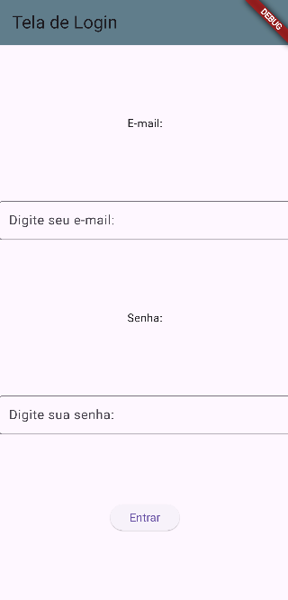
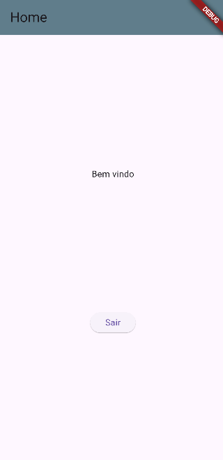

# TelaLogin - JSON
Aplicativo simples com duas telas **Login** e **Home** e autenticação com dados do arquivo dados.json

|  ||
|---------------------------------------------|-|
| Tela de login                               |Tela Home|

## Tecnologias
- Flutter
- Dart
- Android Studio
- VsCode

## Para testar
- Clone este repositório
- Abra com Android Studio ou VsCode
- Execute em um navegador web ou emulador
```bash
fletter run
```

## Desafio
- 1 Autentica com um dos usuários do arquivo dados.json
- assets/dados.json
```json
{
  "users": [
    {
      "id": 1,
      "nome": "Ana Silva",
      "email": "ana@email.com",
      "senha": "senai123"
    },
    {
      "id": 2,
      "nome": "Marcelo Silva",
      "email": "marcelo@email.com",
      "senha": "senai123"
    },
    {
      "id": 3,
      "nome": "Maria Silva",
      "email": "maria@email.com",
      "senha": "senai123"
    }
  ]
}
```